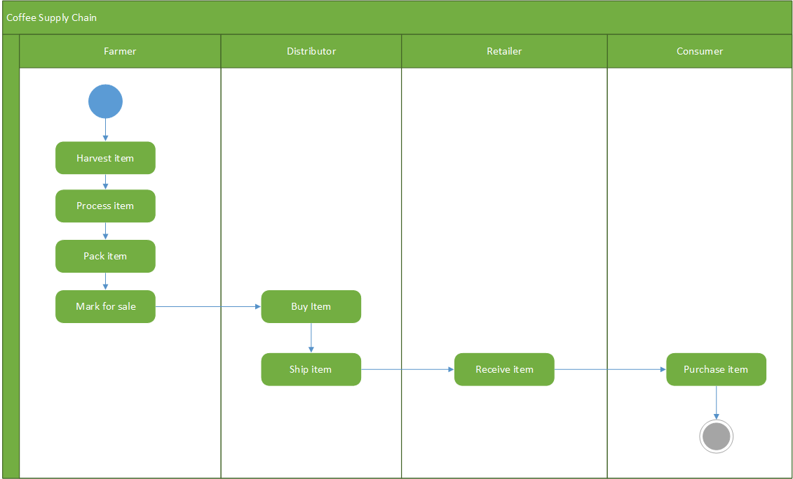
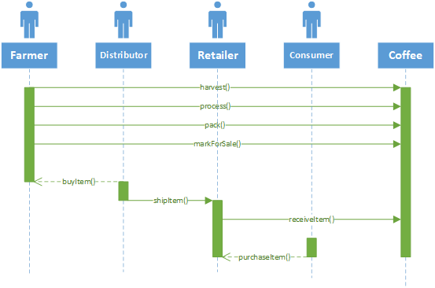
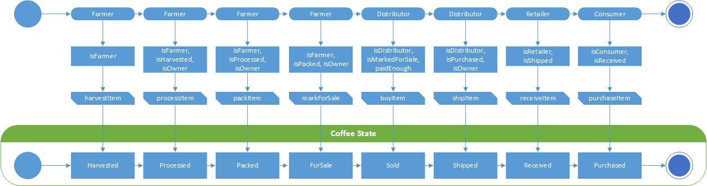
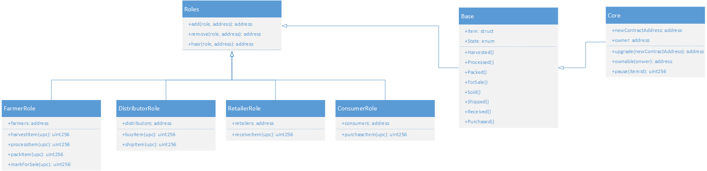
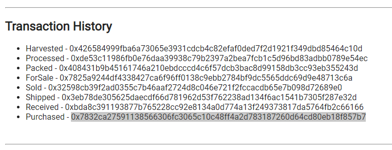

# UML diagrams

## Activity

## Sequence

## State

## Classes (Data Model)

# Libraries Used

HDWalletProvider was used for deploying the contracts to the test netwkork.

# IPFS

IPFS wasn't used in the current version of the project. The optional requirement for this project will be added later on.

# Versions

- Node: v10.14.0
- Truffle: v4.1.15 (core: 4.1.15)
- Solidity: v0.4.25 (solc-js)
- web3: 1.2.1
- @truffle/hdwallet-provider": ^1.0.33

# Project Information

As result of testing the deployed contrat, the following transactions where created:

## Transaction History
- Harvested - [0x426584999fba6a73065e3931cdcb4c82efaf0ded7f2d1921f349dbd85464c10d](https://rinkeby.etherscan.io/tx/0x426584999fba6a73065e3931cdcb4c82efaf0ded7f2d1921f349dbd85464c10d)
- Processed - [0xde53c11986fb0e76daa39938c79b2397a2bea7fcb1c5d96bd83adbb0789e54ec](https://rinkeby.etherscan.io/tx/0xde53c11986fb0e76daa39938c79b2397a2bea7fcb1c5d96bd83adbb0789e54ec)
- Packed - [0x408431b9b45161746a210ebdcccd4c6f57dcb3bac8d99158db3cc93eb355243d](https://rinkeby.etherscan.io/tx/0x408431b9b45161746a210ebdcccd4c6f57dcb3bac8d99158db3cc93eb355243d)
- ForSale - [0x7825a9244df4338427ca6f96ff0138c9ebb2784bf9dc5565ddc69d9e48713c6a](https://rinkeby.etherscan.io/tx/0x7825a9244df4338427ca6f96ff0138c9ebb2784bf9dc5565ddc69d9e48713c6a)
- Sold - [0x32598cb39f2ad0355c7b46aaf2724d8c046e721f2fccacdb65e7b098d72689e0](https://rinkeby.etherscan.io/tx/0x32598cb39f2ad0355c7b46aaf2724d8c046e721f2fccacdb65e7b098d72689e0)
- Shipped - [0x3eb78de305625daecdf66d781962d53f762238ad134f6ac1541b7305f287e32d](https://rinkeby.etherscan.io/tx/0x3eb78de305625daecdf66d781962d53f762238ad134f6ac1541b7305f287e32d)
- Received - [0xbda8c391193877b765228cc92e8134a0d774a13f249373817da5764fb2c66166](https://rinkeby.etherscan.io/tx/0xbda8c391193877b765228cc92e8134a0d774a13f249373817da5764fb2c66166)
- Purchased - [0x7832ca27591138566306fc3065c10c48ff4a2d783187260d64cd80eb18f857b7](https://rinkeby.etherscan.io/tx/0x7832ca27591138566306fc3065c10c48ff4a2d783187260d64cd80eb18f857b7)

All of the above was made for SKU: 1 UPC: 1.

# Deployed Contract

Deployed to the Rinkeby Test Network

Transaction ID: [0xfad212e8e4c0ef85e1ce5bd57a85fa3a4be72d7645e32fec02253136fd6825ed](https://rinkeby.etherscan.io/tx/0xfad212e8e4c0ef85e1ce5bd57a85fa3a4be72d7645e32fec02253136fd6825ed)

Contract address: [0x662AD000B78d08215048A3e4A7F299B209DbA016](https://rinkeby.etherscan.io/address/0x662AD000B78d08215048A3e4A7F299B209DbA016)
